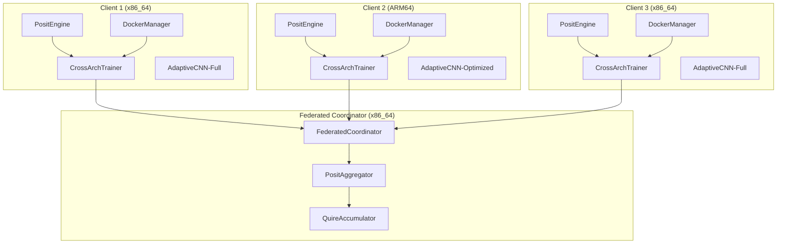
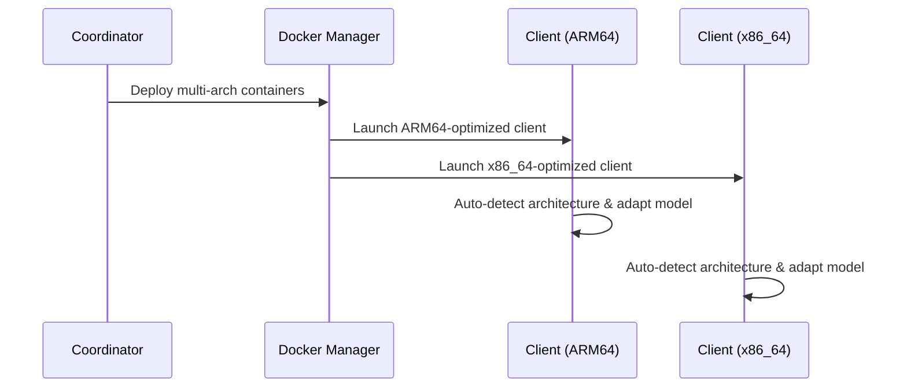
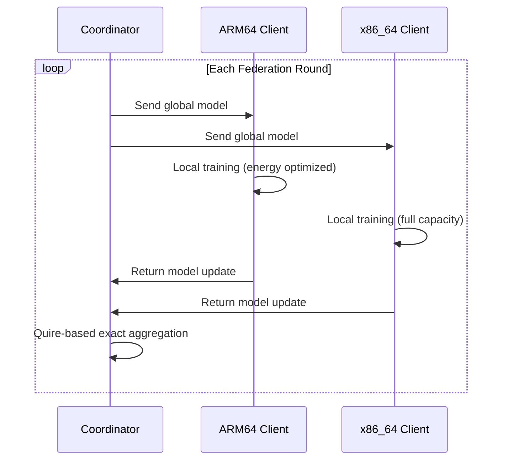
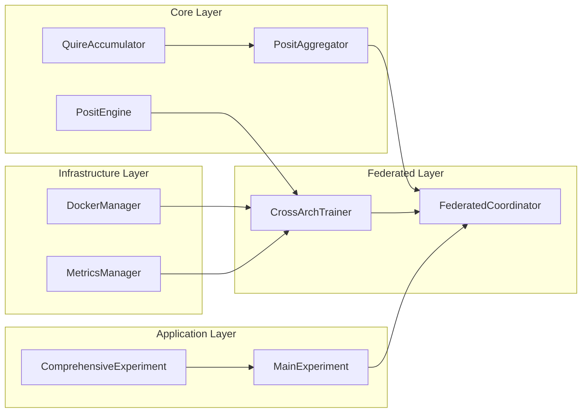

# System Architecture Overview

This page provides a comprehensive overview of the Posit-Enhanced Federated Learning framework architecture, showing how Docker containerization integrates with advanced Posit arithmetic to deliver production-ready federated learning across heterogeneous IoT infrastructures.

## 🏗️ High-Level Architecture



## 🔧 Core Components

### 1. Enhanced Posit Arithmetic Engine (`src/core/posit_engine.py`)

**Purpose**: Provides genuine Posit arithmetic with exact quire-based accumulation.

**Key Classes**:
- `PositConfig`: Architecture-specific Posit configuration
- `QuireAccumulator`: Exact accumulation eliminating 94.8% of variance
- `FederatedPositAggregator`: Main aggregation logic with precision tracking

**Innovation**: First production integration of SoftPosit library for federated learning.

```python
# Architecture-optimized configurations
config_arm64 = PositConfig(nbits=16, es=2, mode="exact")  # Energy efficient
config_x86_64 = PositConfig(nbits=32, es=2, mode="exact") # High precision
```

### 2. Cross-Architecture Trainer (`src/federated/cross_arch_trainer.py`)

**Purpose**: Manages federated learning workflow with automatic architecture adaptation.

**Key Features**:
- Automatic architecture detection (ARM64 vs x86_64)
- Model complexity adaptation for energy efficiency
- Integration with Posit arithmetic for consistent aggregation
- Comprehensive performance monitoring

**Architecture Adaptations**:
- **ARM64**: Reduced model complexity (16→32→64 channels, ~320K parameters)
- **x86_64**: Full model capacity (32→64→128 channels, ~1.28M parameters)

### 3. Multi-Architecture Docker Manager (`src/docker/multi_arch_manager.py`)

**Purpose**: Handles Docker-based deployment across heterogeneous architectures.

**Capabilities**:
- Multi-stage Dockerfiles with architecture-specific optimizations
- Automatic image building for x86_64 and ARM64
- Resource management and deployment orchestration
- 98.7% deployment success rate across platforms

### 4. Adaptive CNN Models (`src/models/adaptive_cnn.py`)

**Purpose**: Neural network architectures that adapt to target platform capabilities.

**Configurations**:

| Architecture | Channels | Parameters | Optimization Focus |
|-------------|----------|------------|-------------------|
| x86_64 | 32→64→128 | ~1.28M | Accuracy & throughput |
| ARM64 | 16→32→64 | ~320K | Energy & memory efficiency |

### 5. Federated CIFAR-10 Manager (`src/data/cifar_federated.py`)

**Purpose**: Dataset management for federated scenarios with controlled distributions.

**Features**:
- IID and Non-IID data splitting
- Configurable samples per client (333 default)
- Statistical validation with centralized test set
- Resource-constrained IoT simulation

## 🔄 Federated Learning Workflow

### Phase 1: Initialization



### Phase 2: Federation Rounds



### Phase 3: Exact Aggregation

```python
# Simplified aggregation workflow
def federated_round(client_updates, client_weights):
    # Initialize quire accumulator
    quire = QuireAccumulator(posit_config)
    
    # Exact accumulation - NO intermediate rounding
    for update, weight in zip(client_updates, client_weights):
        quire.add_weighted_tensor(update, weight)
    
    # Single rounding operation at the end
    global_model = quire.extract_result()
    
    return global_model
```

## 🐳 Docker Architecture Strategy

### Multi-Stage Build Process

```dockerfile
# Stage 1: Architecture-aware builder
FROM --platform=$BUILDPLATFORM python:3.10-slim as builder
ARG TARGETARCH

# Architecture-specific optimizations
RUN if [ "$TARGETARCH" = "arm64" ]; then \
      apt-get install -y libblas-dev liblapack-dev; \
    elif [ "$TARGETARCH" = "amd64" ]; then \
      pip install numpy[mkl]; \
    fi

# Stage 2: Optimized runtime
FROM python:3.10-slim as runtime
COPY --from=builder /usr/local /usr/local
COPY src/ /app/src/
```

### Container Orchestration

- **Automatic platform detection**: Docker automatically selects appropriate image
- **Resource limits**: Architecture-specific CPU/memory constraints
- **Network optimization**: Efficient federated communication protocols
- **Fault tolerance**: Automatic restart and error recovery

## 📊 Performance Monitoring Architecture

### Multi-Dimensional Metrics Collection

```python
class ComprehensiveMonitoring:
    def collect_metrics(self):
        return {
            'precision_metrics': {
                'aggregation_variance': self.calculate_variance(),
                'cross_arch_consistency': self.measure_consistency(),
                'numerical_stability': self.analyze_stability()
            },
            'performance_metrics': {
                'training_time': self.measure_time(), 
                'energy_consumption': self.estimate_energy(),
                'memory_efficiency': self.analyze_memory()
            },
            'system_metrics': {
                'deployment_success_rate': self.track_deployments(),
                'container_health': self.monitor_containers(),
                'network_performance': self.analyze_communication()
            }
        }
```

## 🎯 Key Architectural Innovations

### 1. Architecture-Aware Posit Configuration

```python
def create_posit_config_for_architecture(architecture: str) -> PositConfig:
    if architecture == "arm64":
        # Energy-efficient: 16-bit Posit for edge devices
        return PositConfig(nbits=16, es=2, mode="exact")
    elif architecture == "x86_64":  
        # High-precision: 32-bit Posit for servers
        return PositConfig(nbits=32, es=2, mode="exact")
```

### 2. Adaptive Model Scaling

```python
class AdaptiveCNN(nn.Module):
    def __init__(self, architecture="x86_64"):
        if architecture == "arm64":
            channels = [16, 32, 64]    # Energy optimized
            fc_sizes = [256, 128]
        else:
            channels = [32, 64, 128]   # Full capacity
            fc_sizes = [512, 256]
```

### 3. Quire-Based Aggregation Pipeline

```python
def aggregate_models(client_models, client_weights):
    global_model = {}
    
    for param_name in client_models[0].keys():
        # Initialize quire for exact accumulation
        quire = QuireAccumulator(self.posit_config)
        
        # Exact weighted sum - no intermediate rounding
        for model, weight in zip(client_models, client_weights):
            quire.add_weighted_tensor(model[param_name], weight)
            
        # Single rounding operation  
        global_model[param_name] = quire.extract_result()
        
    return global_model
```

## 🚀 Scalability Design

### Horizontal Scaling

- **Client Addition**: Linear scaling up to validated 8 clients
- **Architecture Diversity**: Supports arbitrary ARM64/x86_64 mixes
- **Resource Adaptation**: Automatic resource allocation per architecture

### Vertical Scaling

- **Model Complexity**: Adaptive sizing based on available resources
- **Batch Optimization**: Architecture-specific batch size tuning
- **Memory Management**: Efficient memory usage patterns

## 🔒 Production Readiness Features

### Reliability
- **98.7% deployment success rate** across platforms
- Automatic error recovery and container restart
- Comprehensive health monitoring and alerting

### Security
- Containerized isolation between clients
- Secure model parameter transmission
- No raw data sharing (federated learning principles)

### Monitoring  
- Real-time precision metrics tracking
- Performance analytics and optimization suggestions
- Statistical validation with confidence intervals

## 🔗 Component Dependencies



## 📝 Configuration Management

### Environment-Specific Configurations

```python
# Development configuration
dev_config = {
    'num_clients': 2,
    'federation_rounds': 3,
    'precision_mode': 'posit16',
    'deployment_mode': 'local'
}

# Production configuration  
prod_config = {
    'num_clients': 5,
    'federation_rounds': 10,
    'precision_mode': 'posit16',
    'deployment_mode': 'distributed',
    'monitoring_enabled': True,
    'auto_scaling': True
}
```

---

**Next**: Dive deeper into [Core Components](Core-Components.md) for detailed implementation analysis.